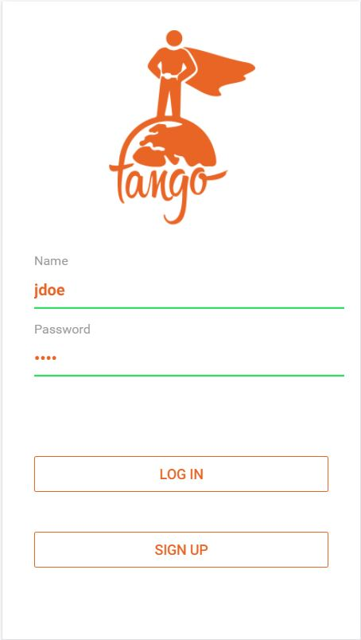
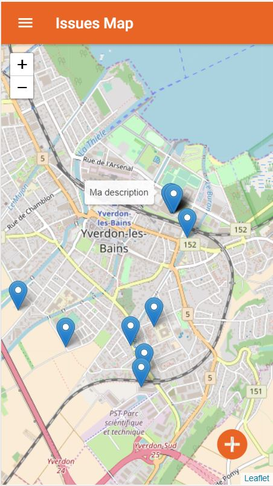
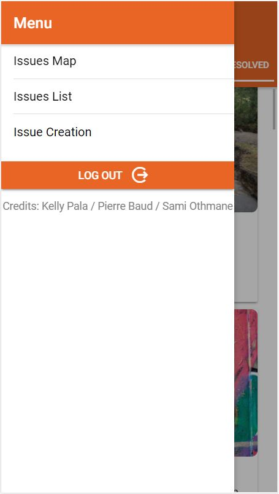
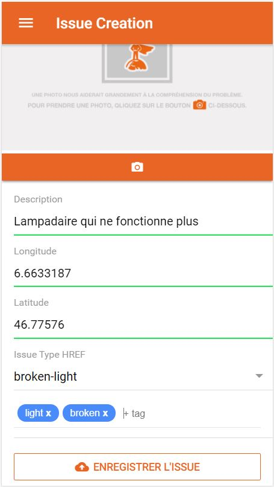
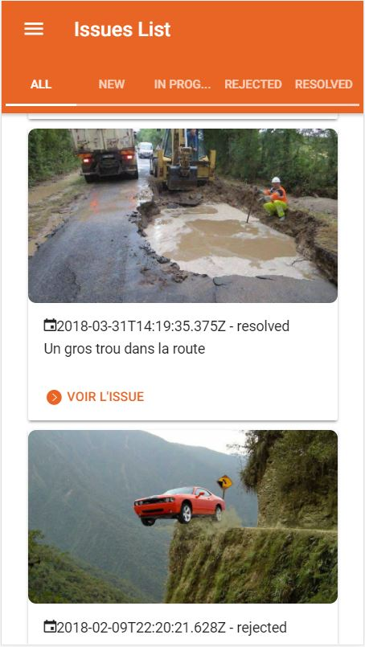
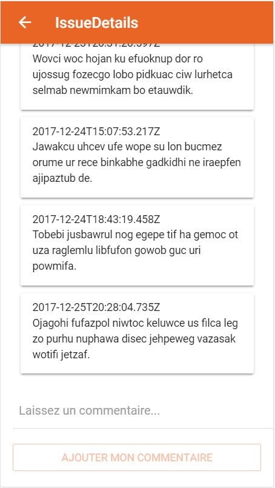
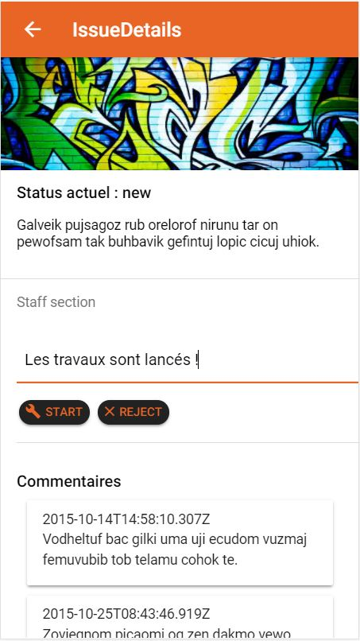
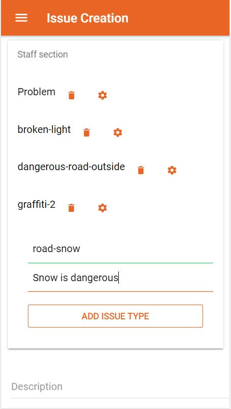

# tango Mobile Application

Bienvenue sur le repository de tango !
tango est une application mobile permettant aux citoyens de signaler des problèmes/incivilités aux établisssements publics de leurs villes afin qu'ils soient pris en charge.

## Index

1. [Login](#login)
2. [Sign up](#signup)
3. [Page accuel](#menuPrincipal)
4. [Menu navigation](#nav)
5. [Signaler un problème](#creerIssue)
6. [Liste des problèmes](#listeIssue)
7. [Commenter un problème](#comm)
8. [STAFF: Modifier le statut d'un problème](#staffStatusPage)
9. [STAFF: Gérer les types de problèmes](#stafsType)

## 1. Login

Au démarrage de l'application, l'utilisateur est invité à se connecter, si il possède déjà un compte, à l'aide de son nom et de son mot de passe.
Si l'utilisateur ne possède pas de compte, il peut se rendre sur la page Sign up afin de créer un nouveau compte.

<a href="#top">Retour en haut de la page</a>

## 2. Sign up

Afin de créer un compte, l'utilisateur doit saisir ses informations personnels ainsi qu'un nom d'utilisateur et un mot de passe. La création de l'utilisateur est possible seulement une fois tous les champs remplis.

<a href="#top">Retour en haut de la page</a>

## 3. Page accueil

Une fois connecté, l'utilisateur est redigiré sur la page d'accueil de l'application. Une map permet de trouver les problèmes des utilisateurs de tango. Chaque marquer a une description et est cliquable afin d'accéder à ses détails.
L'utilisateur peut également signaler un problème directement sur cette écran à l'aide du bouton '+'.

<a href="#top">Retour en haut de la page</a>

## 4. Menu de navigation

En cliquant sur le bouton , l'uilisateur accède au menu afin de naviguer dans l'application.

<a href="#top">Retour en haut de la page</a>

## 5. Signaler un problème

Afin de signaler un problème, l'utilisateur est invité à entrer quelques informations concernant le problème. Un problème a besoin d'une description, une position et un type de problème. En plus, l'utilisateur a la possibilité d'ajouter une photo ainsi que des tags.
L'utilisateur est automatiquement géolocalisé afin de connaître l'emplacement du problème. Cependant, les champs restent éditables afin que l'utilisateur puisse bénéficer d'une totale liberté.  

<a href="#top">Retour en haut de la page</a>

## 6. Liste des problèmes

Sur cette écran, l'utilisateur peut consulter la liste des problèmes. Les problèmes sont filtrés par leur status ('new', 'rejected', etc). Il est également possible de voir le détail d'un problème en cliquant sur 'voir l'issue'.

<a href="#top">Retour en haut de la page</a>

## 7. Commenter un problème

L'utilisateur a la possibilité de commenter un problème.

<a href="#top">Retour en haut de la page</a>

## 8. [STAFF] Modifier le statut d'un problème

L'uilisateur, avec le rôle de staff, peut mettre à jour le statut d'un problème afin de le faire avancer dans le processus de résolution.

<a href="#top">Retour en haut de la page</a>

## 9. [STAFF] Gérer les types de problèmes

L'uilisateur, avec le rôle de staff, peut créer, modifier ou supprimer des types de problèmes. Cette fonctionnalité est accessible sur la page Issue Creation et seul les types non-utilisé peuvent être supprimer.

<a href="#top">Retour en haut de la page</a>

### Installing
